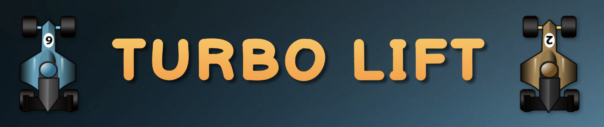

 
  

<h1 align="center"> Turbo Lift </h1>
<h3 align="center"> Bilal Afzaal </h3>
<h4 align="center"> PLAY HERE: </h4>
<h6 align="center"><a href="https://play.unity.com/mg/other/turbo-lift-v1">https://play.unity.com/mg/other/turbo-lift-v1</a></h6>

<!-- TABLE OF CONTENTS -->
## Table of Contents

* [About the Project](#about-the-project)
  * [Overview](#overview)
  * [App Screenshots](#app-screenshots)
  * [Built With](#built-with)
* [How To Play](#how-to-play)
  * [Objective](#objective)
  * [Controls](#controls)

<!-- ABOUT THE PROJECT -->
## About The Project

### Overview

 
   Turbo Lift is a breath of fresh air that combines aspects of racing, simulation and strategy. Turbo Lift will keep you guessing while you are on your quest to pick up and drop off passengers in record time.

### App Screenshots

Game  Menu         |  Game Play | Game Complete      
:-------------------------:|:-------------------------:|:-------------------------:
 ||

### Built With
- [Unity](https://unity.com/)
- [C#](https://docs.microsoft.com/en-us/dotnet/csharp/)

<!-- HOW TO PLAY -->
## How To Play

### Objective

### Controls

