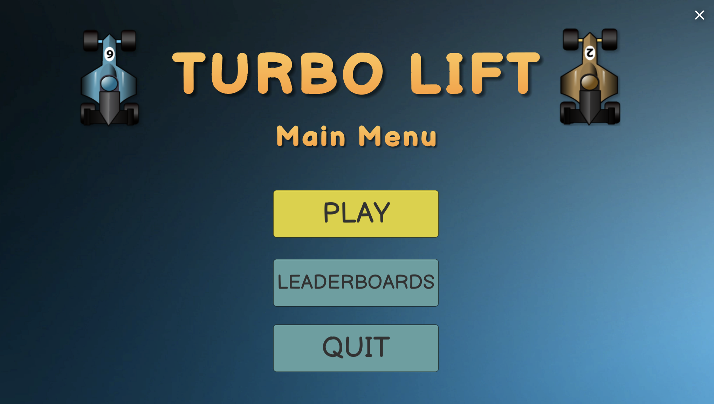
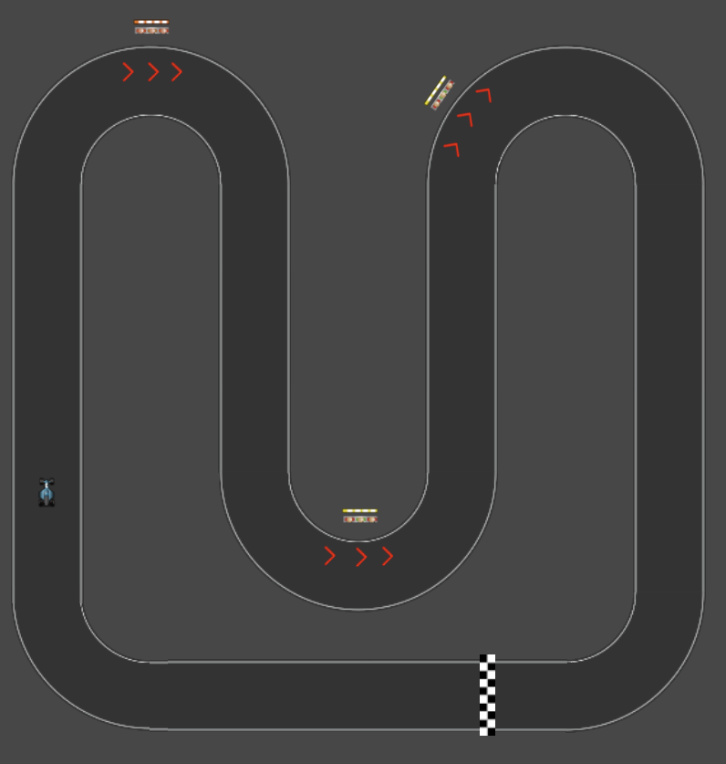

 
  

<h1 align="center"> Turbo Lift </h1>
<h2 align="center"> Group Members: </h3>
<h3 align="center"> Bilal Afzaal - bafzaal </h3>
<h3 align="center"> Osman Abdalle - oabdalle </h3>
<h3 align="center"> Jayson Pols - jpols </h3>

<h4 align="center"> PLAY HERE: </h4>
<h6 align="center"><a target="_blank" href="https://play.unity.com/mg/other/turbolift">https://play.unity.com/mg/other/turbolift</a></h6>

<!-- TABLE OF CONTENTS -->
## Table of Contents

- [Table of Contents](#table-of-contents)
- [About The Project](#about-the-project)
  - [Overview](#overview)
  - [App Screenshots](#app-screenshots)
  - [Built With](#built-with)
- [How To Play](#how-to-play)
  - [Objective](#objective)
  - [HUD](#hud)
  - [Gameplay](#gameplay)
  - [Maps](#maps)
  - [Controls](#controls)

<!-- ABOUT THE PROJECT -->
## About The Project

### Overview

 
   Turbo Lift is a breath of fresh air that combines aspects of racing, simulation and strategy. Turbo Lift will keep you guessing while you are on your quest to pick up and drop off passengers in record time.

### App Screenshots

Game  Menu         |  Game Play | Game Complete      
:-------------------------:|:-------------------------:|:-------------------------:
 ||

### Built With
- [Unity](https://unity.com/)
- [C#](https://docs.microsoft.com/en-us/dotnet/csharp/)
- [LootLocker Unity SDK](https://github.com/LootLocker/unity-sdk)

<!-- HOW TO PLAY -->
## How To Play

### Objective

 
   The Objective of TurboLift is to pick up passengers and drop them off to the destination location (finish line) in the fastest time possible.

### HUD
HUD Element             |  Description
:-------------------------:|:-------------------------:
  | 
 First value indicates the amount of passengers that have been picked up and are currently in the Turbo Car. Second value indicates total amount of passengers on the map that need to be picked up.

 |  
 Total elapsed time.

 |  
 Speed of the Turbo Car.

### Gameplay
Game Element             |  Description
:-------------------------:|:-------------------------:
  | 
 The passengers are on the side of the road. In order to pick them up the car must drive over one of the red arrows.

 |  
 Once the car drives over a red arrow. The passengers disappear and the PassengerHUD count is incremented. This indicates that the passenger has been picked up and is ready to be dropped off to the target location. 

 |  
 The finish line is the target destination where all passengers must be dropped off at. 

 |  
 Be wary of the mud as it will slow the car down. Try to avoid it! 

 |  
 Pick up the boost to go turbo! This will speed up your car and allow you to finish the track faster. 

 |  
 Find the car of your choice in the car select screen. Each car has their own stats for acceleration and handling. 

 |  
 View the best TurboLift players for each map. 

### Maps

Box Boulevard         |  Winding Trail | Rocky Road     
:-------------------------:|:-------------------------:|:-------------------------:
 ||

### Controls
Button             |  Description
:-------------------------:|:-------------------------:
W or ↑| 
 Accelerate and drive forward 

S or ↓| 
 Brake and reverse the car 

A or ← | 
 Steer Left 

D or → | 
 Steer Right 

